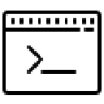

# Logger Plugin

Logger is a plugin for Visual Studio Code that provides advanced console logging snippets for JavaScript and TypeScript.

## Installation

1. Launch Visual Studio Code.
2. Open the Extensions view by clicking on the square icon on the sidebar or by pressing `Ctrl+Shift+X`.
3. Search for "Logger" and click **Install**.
4. Once the installation is complete, click **Reload** to activate the Logger plugin.

## Features

- Console log advanced snippet: Use the `-log` snippet to quickly log a variable with its name and value.
- Date snippet: Use the `-date` snippet to insert the current date.
- Time snippet: Use the `-time` snippet to insert the current time.
- Path snippet: Use the `-path` snippet to insert the file path.
- Line snippet: Use the `-line` snippet to insert the current line number.
- Comment snippet: Use the `-comment` snippet to quickly insert a comment.

## Usage

1. Open a JavaScript or TypeScript file in Visual Studio Code.
2. Start typing one of the snippet prefixes (e.g., `-log`) where you want to use the snippet.
3. Select the snippet suggestion that appears and press `Enter` or `Tab`.
4. Customize the snippet placeholders as needed.
5. Continue coding with the added snippet.

## Contributing

Contributions are welcome! If you have any suggestions, bug reports, or feature requests, please create an issue on the [GitHub repository](https://github.com/amirrr1987/logger).

## Author

- Name: Amir Maghami
- Website: [http://amirmaghami.ir/](http://amirmaghami.ir/)
- GitHub: [https://github.com/amirrr1987](https://github.com/amirrr1987)

## License

This plugin is released under the [MIT License](LICENSE).
